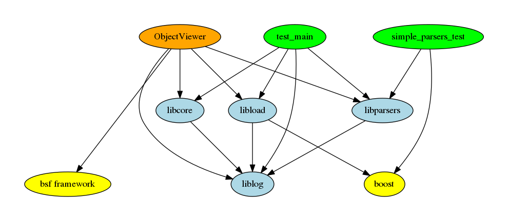

# BVE-Reborn

|             |  Master  |   Dev  |
|:------------|:---------|:-------|
| Windows     | [](https://ci.appveyor.com/project/cwfitzgerald/bve-reborn/branch/master) | [](https://ci.appveyor.com/project/cwfitzgerald/bve-reborn/branch/dev) |
| Mac & Linux | [](https://travis-ci.org/BVE-Reborn/bve-reborn)                                                 | [](https://travis-ci.org/BVE-Reborn/bve-reborn)                                              |
| Coverage    | [](https://coveralls.io/github/BVE-Reborn/bve-reborn?branch=master)        | [](https://coveralls.io/github/BVE-Reborn/bve-reborn?branch=dev)        |

# Building

## Linux

To build on linux you have two different methods. If you are on ubuntu you may install boost via apt. All other platforms must follow the instructions to build boost locally.

#### Ubuntu

```commandline
sudo apt install libboost-all-dev
```

#### Others

```commandline
bash ./build-depts-unix.sh
```

After you have installed or compiled boost, then you can follow these commands to build the project using cmake.

```commandline
mkdir build
cd build
cmake ..
make
```

## Windows

Building on windows is similar to building via script on linux, but there is one extra step because windows has no way of automatically downloading and extracting boost from a zip file.

First download boost 1.64.0 from [here](https://dl.bintray.com/boostorg/release/1.64.0/source/) into the folder dependencies/binary/downloads. Extract the result into dependencies/binary/src/boost/. This will create a subfolder called boost_1_64_0. Then open a command line tool and run build-deps-win.bat. This will go through the process of building boost. After that you may open up the project using VS's cmake integration, or use CMAKE-GUI to turn the project into a visual studio solution. Whichever is better for you.

# Project Structure



There are three parts to the description of this project's structure. First is this list of all libraries and dependencies. Second is the graph showing the interdependencies between libraries. Third is each library's internal structure description, found as a readme file within the folder. This description includes libraries not yet implemented in order to show the feature plans of the project.

 - dependencies
   - [bin2c](https://github.com/cwfitzgerald/bin2c) - Used for automated conversion between a file and a c/c++ array. This is the only portable way of including binary files within an executable. 
   - binary
     - boost - used for `boost::optional`, `boost::filesystem`, and `boost::regex`. This is the only current binary dependency. 
   - [bsf framework](https://github.com/GameFoundry/bsf) - Used as the graphics engine and window management.
   - cmake - A single third party cmake file which enables code coverage within builds.
   - [cmake-santiziers](https://github.com/arsenm/sanitizers-cmake/tree/6947cff3a9c9305eb9c16135dd81da3feb4bf87f) - A cmake library which enables use of the the c++ sanitizers.
   - [cmake-utils](https://github.com/cwfitzgerald/cmake-utils/tree/002fbf11a9448bf4c297ac34dd31e277b9f30c1f) - A cmake library which adds a variety of helping features for ease of cmake use.
   - [cotire](https://github.com/sakra/cotire/tree/cotire-1.8.0) - A cmake library which adds compile time saving features like precompiled headers and unity builds.
   - [cpp_guildlines_support_library](https://github.com/Microsoft/GSL/tree/v1.0.0) - A c++ library for assisting the c++ core guildlines. Mainly used for `gsl::span`, `gsl::string_span`, and `gsl::narrow`.
   - [doctest](https://github.com/onqtam/doctest/tree/1.2.9) - Primary testing library.
   - [glm](https://github.com/g-truc/glm/tree/0.9.9-a2) - Used for opengl math helpers and other geometric operations.
   - [mapbox-variant](https://github.com/mapbox/variant/tree/v1.1.5) - Used instead of boost::variant due to better performance and better features.
   - [rapidxml](http://rapidxml.sourceforge.net/) - Fastest xml parser in the land.
 - libcore - Central support libraries for bvereborn. Math functions go in here, as well as other hard to place utility functions.
 - libload - Helps with loading of files which depend on other files.
 - liblog - Thread-safe logging library
 - libparsers - Parses all formats dealt with in the program, contains some helper features for file manipulation.
 - test_main - Main entry point to all the tests throughout the program.
[Global](global.html)

# TODO

 See [TODO.md](TODO.md)
